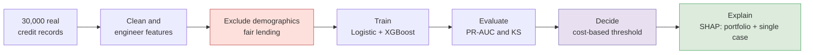
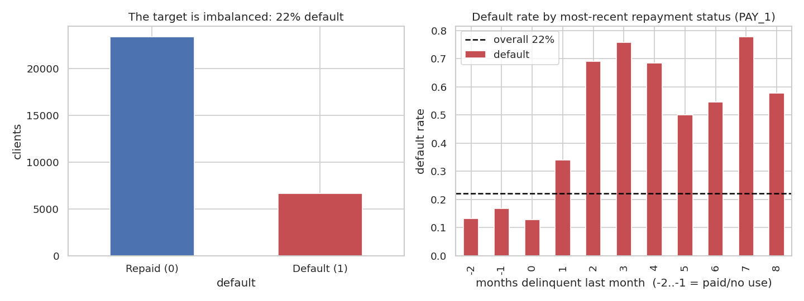
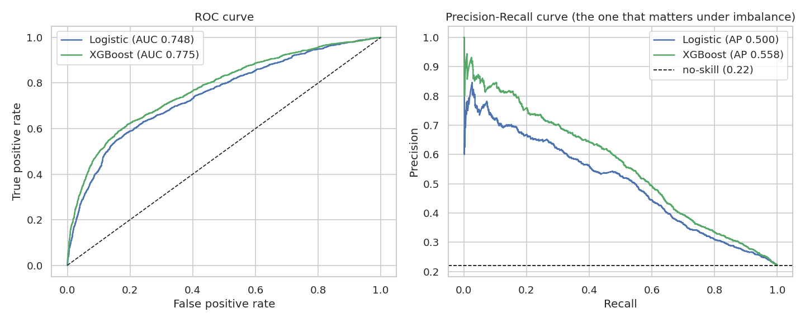
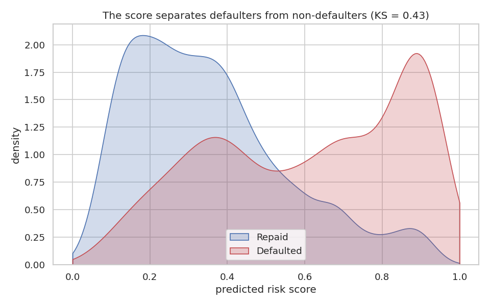
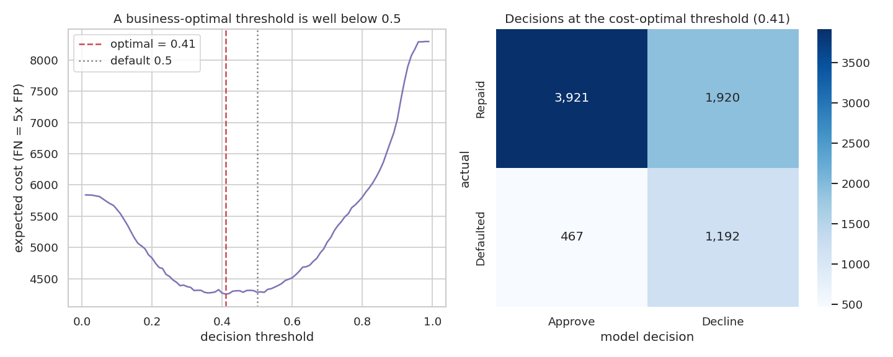
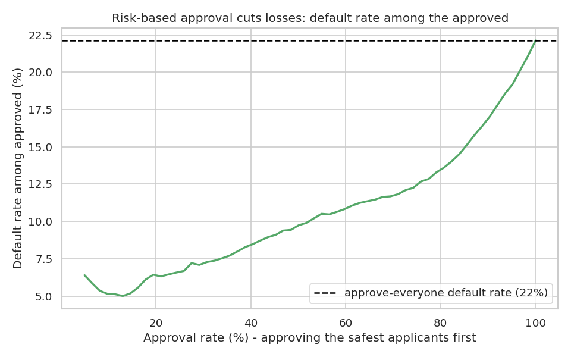
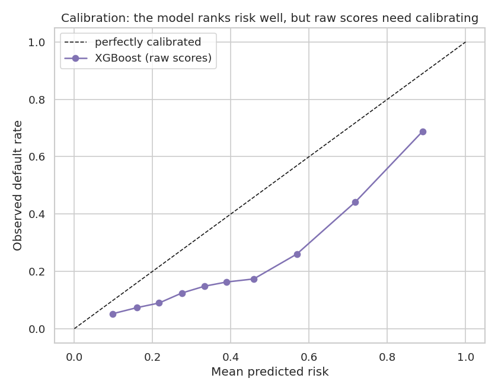
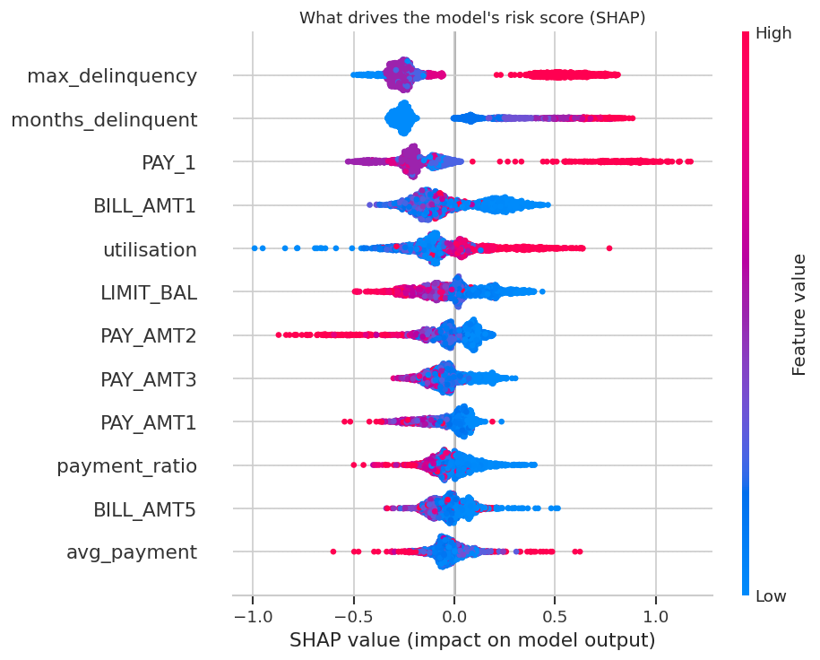
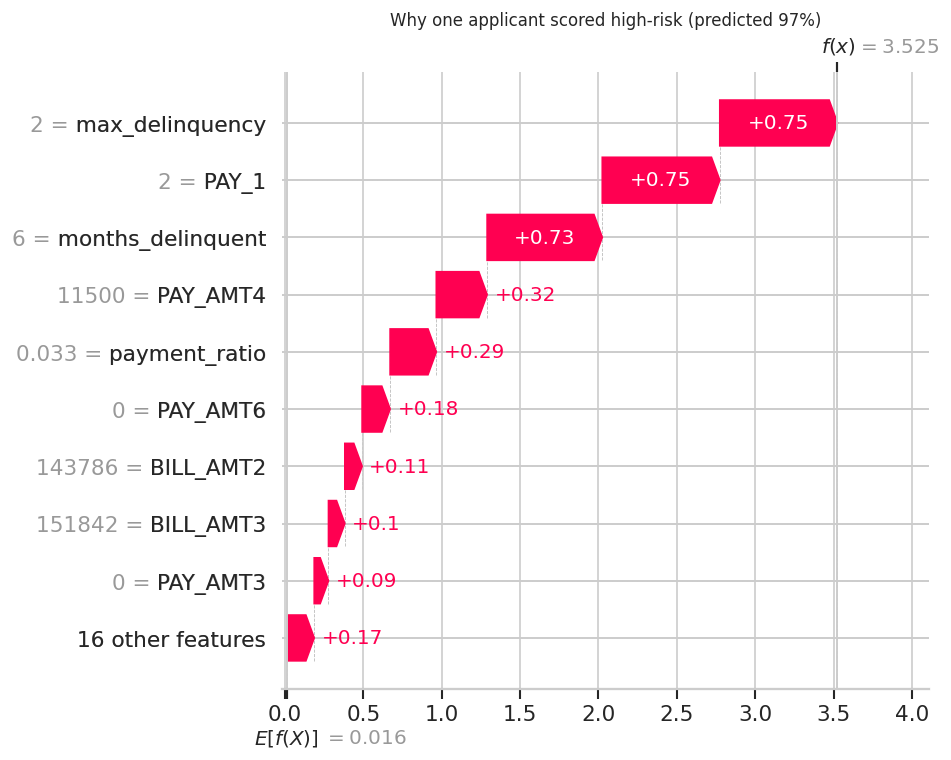

# Predicting Loan Default the Way a Credit Team Actually Does It

A credit-risk model built on **real lending data**, with the things that actually matter in lending: an **imbalanced** target handled with the right metrics, a **cost-based decision** rather than a blind 0.5 cutoff, mandatory **explainability** (at both the portfolio and the single-applicant level), and demographic attributes **excluded for fair-lending reasons**.

**Data:** the UCI *Default of Credit Card Clients* dataset, 30,000 real credit-card customers with six months of repayment, billing and payment history and a real next-month default label.

---

## Results at a glance

| | Logistic Regression | **XGBoost** | No-skill baseline |
|---|---|---|---|
| ROC-AUC | 0.748 | **0.775** | 0.500 |
| PR-AUC | 0.500 | **0.558** | 0.221 |
| KS statistic | | **0.43** | 0 |

- A **cost-based threshold** turns the score into a decision: at a 10:1 cost of a missed default versus a wrongly-declined customer, the model catches **92% of defaulters**.
- **Risk-based approval** cuts the default rate among approved customers from **22% to under 10%**.
- The risk drivers (via SHAP) are what a credit analyst would expect, and a **single decision can be explained** line by line.

---

## How it works



Two choices set this apart from a typical default notebook:

- **Accuracy is the wrong metric.** With 22% default, "approve everyone" scores 78% accuracy and is useless. The work optimises and reports **PR-AUC, KS and recall** instead.
- **Fair lending by design.** Sex, age, marital status and education are **excluded** from the model; a lender generally cannot decide on protected characteristics. They would be used only to audit fairness, never to score.

---

## 1. The target is imbalanced, and one feature dominates



Only 22% of customers default, so the model has to find a minority. The right panel is the single most important picture in the project: default rate by **most-recent repayment status**. Customers who paid on time default about 13% of the time; those two months behind default about 69% of the time. Repayment behaviour, not balances or limits, is the spine of the signal.

## 2. Two models, judged on the right curves



A class-weighted logistic regression (the interpretable baseline) and an imbalance-tuned XGBoost. The **precision-recall curve on the right is the one that matters**: under 22% prevalence a random model's precision is only 0.22, so the gap above that line is the real lift. XGBoost reaches PR-AUC 0.56 and clearly beats the linear model.

## 3. How cleanly does the score separate good from bad?



Beyond a single AUC number, the two score distributions show the separation directly: defaulters concentrate at high scores, repayers at low ones. The **Kolmogorov-Smirnov statistic** (the largest gap between the two cumulative distributions, a standard credit-scoring measure) is **0.43**, solid separation for a behavioural model.

## 4. From a score to a decision: cost-based thresholding



The model outputs a risk score; the **business** sets the threshold. A missed default costs far more than a wrongly-declined good customer, so the cost-minimising cutoff sits well below 0.5, and it moves with the cost ratio:

| Cost of a missed default | Threshold | Defaulters caught | Applicants approved |
|---|---|---|---|
| 2x a bad decline | 0.65 | 51% | 81% |
| 5x | 0.41 | 72% | 59% |
| 10x | 0.22 | 92% | 26% |

This is where modelling meets commercial strategy: there is no single "right" threshold without a view on what each error costs.

## 5. The commercial picture: risk-based approval



Approving the safest customers first, the default rate among the approved book falls sharply below the 22% population rate: approve the safest 50% and it drops to **9.7%**, the safest 70% and it is **11.8%**. This is the value of the model stated in the language a lending business uses.

## 6. Are the scores usable as probabilities?



The model **ranks** risk well (that is what AUC and KS measure), but the raw XGBoost scores are not calibrated probabilities, the curve sits off the diagonal because class weighting inflates them. Before a score is used as a *probability of default*, it should be calibrated (isotonic or Platt). Flagging this is what separates a usable score from a misleading one.

## 7. Why the model decides what it decides (SHAP)



Regulated lending needs explainability. Across the portfolio, SHAP confirms credit-sensible logic: **recent and maximum delinquency** dominate, followed by **utilisation** and **credit limit**; larger payments push risk down. No surprising or spurious driver is doing the work.

## 8. Explaining a single decision



Aggregate importance is not enough in lending; you have to justify one specific decision. This applicant scored **97% risk**, and the reasons are legible, exactly what an adverse-action explanation would contain: behind in all six months, two months behind last month, repaying almost none of the balance. Each bar is one feature's contribution to that customer's score.

---

## Data licence & citation

The **code** here is MIT-licensed (see `LICENSE`). The **data is not mine**: it comes from the UCI Machine Learning Repository under **CC BY 4.0** and originates with the study below. Please cite the authors if you reuse it.

> Yeh, I-C., and Lien, C-H. (2009). The comparisons of data mining techniques for the predictive accuracy of probability of default of credit card clients. *Expert Systems with Applications*, 36(2), 2473-2480.
> Dua, D. and Graff, C. UCI Machine Learning Repository, https://archive.ics.uci.edu/dataset/350. Licence: CC BY 4.0.

---

## Run it

```bash
pip install -r requirements.txt
python analysis.py                       # reproduces all eight figures
# or open the narrative version:
jupyter notebook credit_default_prediction.ipynb
```

## Repo structure

```
.
├── credit_default_prediction.ipynb   # narrative analysis (executed, 8 figures)
├── analysis.py                        # same analysis as a script
├── README.md
├── LICENSE
├── requirements.txt
├── data/                              # the UCI dataset + scored test set
└── figures/                           # generated charts
```

---

## Limitations

- **Behavioural features need history** (six months of repayments), so the model scores existing customers better than thin-file new applicants. That cold-start gap is real.
- **No income field**, so this is *behavioural* scoring, not affordability. Affordability is the subject of a companion project.
- **Raw scores need calibrating** (isotonic or Platt) before being read as probabilities of default.
- **Fairness** is handled here by exclusion; a production system would also audit outcomes across groups.

*Data: UCI Machine Learning Repository, "Default of Credit Card Clients" (CC BY 4.0). Built as a portfolio project.*
